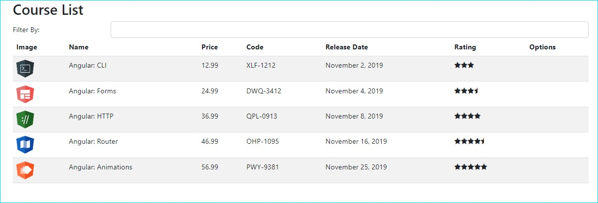

<h1 align="center">
CourseManager-Angular
</h1

Este projeto foi gerado com [Angular CLI](https://github.com/angular/angular-cli) versão 15.2.4. Através dele são listados alguns cursos com preço, data de lançamento, avaliação e campo de fitragem dinâmica.   
Nele são aplicados conceitos de módulos, componentes, eventos data binding e injeção de dependência.

## Servidor de desenvolvimento

Execute `ng serve` para iniciar a aplicação. Navegue até `http://localhost:4200/`. O aplicativo será carregado automaticamente se você alterar qualquer um dos arquivos de origem.

## Estrutura de código

Execute `ng generate component component-name` para gerar um novo componente. Você também pode usar `ng generate directive|pipe|service|class|guard|interface|enum|module`.

## Build

Execute `ng build` para compilar o projeto. Os artefatos de compilação serão armazenados no diretório `dist/`.

## Executando testes unitários

Utilize o comando `ng test` para executar os testes de unidade via [Karma](https://karma-runner.github.io).

## Executando testes de ponta a ponta

Digite o comando`ng e2e` para executar os testes de ponta a ponta por meio de uma plataforma de sua escolha. Para usar esse comando, você precisa primeiro adicionar um pacote que implemente recursos de teste de ponta a ponta.
